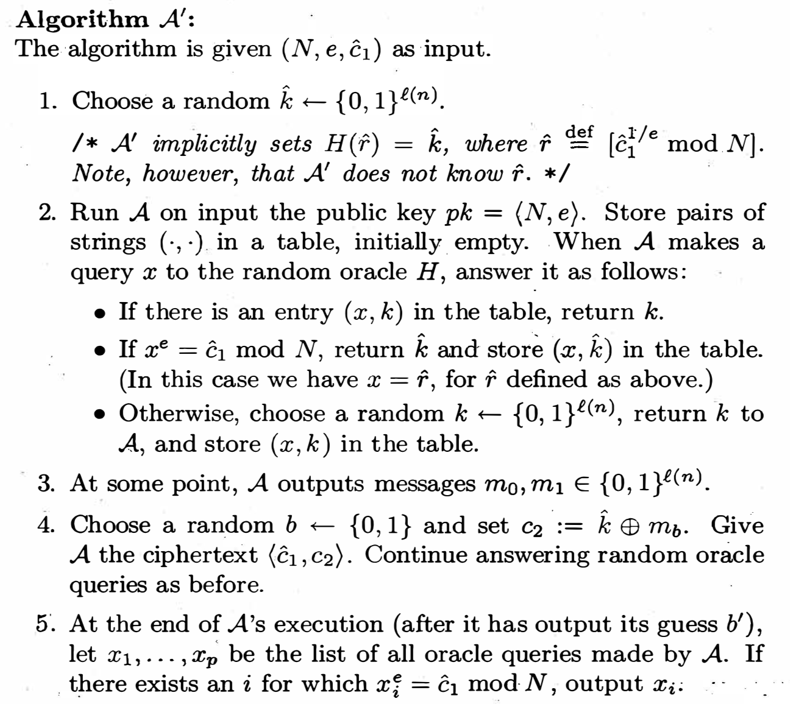

## About Random Oracle Model

A function _H: {0,1}*_—>{0,1}*

* Each bit of _H(x)_ is random.
* The output is uniform and independent (treat it as randomly chosen on the fly).

_If an adversary A has not **explicitly** queried the oracle on some point x, then the value of **H(x) is completely random** (at least as far as A is concerned)_

Note that it is different from **pseudorandom generator G(x)**, where _G(x)_ is pseudorandom to _x_ which is chosen uniformly at random and is unknown for the adversary. For random oracle, however, _H(x)_ is truly random as long as the adversary has not query  _x_ before. This still holds even if _x_ has been known and is not uniformly random. 

## Why we need random oracle model

There are few public-key cryptosystems that are both: (1) efficient enough in practice and (2) can be proven secure in the standard model.  It is hard to design an efficient crypto system based on the number theory assumptions (e.g., factoring problem, DDH assumption, etc.). Therefore, users may prefer to use _nothing_ instead of an inefficient algorithm. 

An alternative approach is to prove the security in an ideal model, e.g., random oracle model. As long as the instantiation of the ideal model in practice is secure (but sure, such an instantiation may not exist), then the scheme proven secure in ROM should also be secure.  In fact, there have been few real-world attacks on schemes proven secure in ROM. At least, such a proof can help to confirm there are no inherent design problems. 

The fundamental reason is the belief [1]:

_A proof in security in the random oracle model is significantly better than no proof at all._

## Prove scheme secure in random oracle model

Generally, the proof is done by a reduction algorithm:

_If the scheme can be broken by the adversary in the random oracle, then a **simulator** can use this ability to violate some hard cryptographic assumptions._

The **reduction** or **simulator** has the following power:

1. **programmability**: The simulator can choose values for the output of **H** as it likes as long as the outputs are uniformly distributed. This gives much advantage for the simulator. For example, the simulator may construct **_H(x)=g^x mod N._** With this power, the simulator can specially craft some constructs of hard problems. 

2. **Observability**:The simulator can see all the queries that Adversary makes to the random oracle. Therefore, the simulator can leverage the power of the adversary to solve some hard problems.

In the formal model, we assume all the queries are private. Here, we are using Adversary as a subroutine within the reduction/ simulator.

## Example: RSA Encryption against Chosen Plaintext Attack in Radom Oracle Model

Obviously, the textbook RSA encryption is not secured. Here, we show how to prove the following variant scheme is secure.

<blockquote>
   

      

	Gen:
        (<var>N</var>,<var>e</var>,<var>d</var>)&lt; -
        <var>G</var>(1&lambda;)
      

      

        Enc: on input <var>a</var> public key (<var>N</var>,<var>e</var>) and
        <var>a</var> message <var>m</var>
        &isin;{0,1}<var>l</var>(<var>n</var>)&#x2063;&#x2063;:
      

      

        (<var>c</var>1,<var>c</var>2) =
        (<var>r</var><var>e</var> mod
        <var>N</var>&#x2063;&#x2063;,<var>H</var>(<var>r</var>)&oplus;<var>m</var>)
         
      

    

    

      Dec:
      <var>m</var> = <var>H</var>(<var>c</var>1<var>d</var> 
      mod <var>N</var>) &oplus; <var>c</var>2
    

</blockquote>

Intuitively, this scheme is secure. Suppose an adversary can break this scheme by query the oracle, then the RSA problem can be solved as follows:

Given (<var>N,e, c1,k’</var>) to the reduction algorithm (here, the simulator guess <var>c1 is the ciphertext returned to the adeversary.), which makes the adversary run under the input (<var>N,e</var>) and ciphertext <var>(c1,c2)</var>. Note that the adversary can get a ciphertext under chosen plaintext attack, thus the assumption is reasonable.

The adversary will query <var>x</var> to the oracle. If it happens that <var>xe mod N = c1</var>, the oracle will output <var>k’</var>, i.e., for any input x, if _x^e=c1_, then just output _k1=H(x)_;
Otherwise, choose a random _k_ as _H(x)_ and store _(x,k)_ in the table.

As <var>k’</var> is chosen randomly, the view of the Adversary is the same as that in the original setting. Note that the simulator  can monitor all the queries made to the oracle. If the query occurs to be the random variable _r_, then the simulator can output the message (_r_) given _c1 = re mode N_. Therefore, the probability of breaking this scheme by ORM should equal to  RSA, which is hard. Thus this scheme is hard.

A formal proof can be found in reference [1] as follows:

This concludes that the query is negligible since RSA problem is hard.

### _Reference:_

[1] Jonathan Katz, Yehuda Lindell, “Introduction to Modern Cryptography”,2007.

[2] M. Bellare and P. Rogaway, “Random oracles are practical: a paradigm for designing efficient protocols”, In _ACM Conf. on Computer and Communication Security_, 1993.
